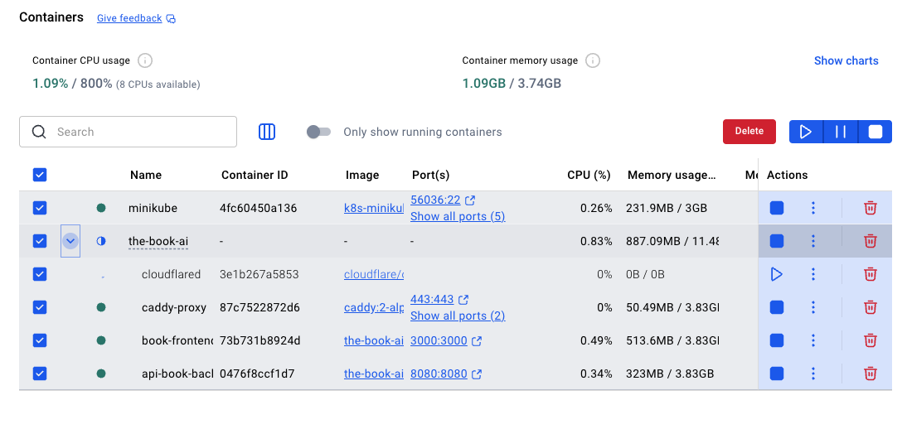

# DEFLANDRE NASSIM 

# The Book AI

Une plateforme web moderne pour générer des histoires personnalisées pour enfants alimentée par l'intelligence artificielle. 

## 📋 Table of Contents

- [Presentation du projet](#Présentation-du-projet)
- [Stack Technique](#stack-technique)
- [Architecture](#architecture)
- [Prérequis](#prérequis)
- [Installation](#installation)
- [Structure du Projet](#structure-du-projet)
- [Configuration](#configuration)

## Présentation du projet

**The Book AI** est une application web qui permet aux utilisateurs de créer des histoires originales et personnalisées pour enfants grâce à une intelligence artificielle générative. La plateforme permet de configurer différents paramètres (thème, personnages, longueur, moral de l'histoire, etc.) pour générer des contes uniques et adaptés à chaque enfant.

### Fonctionnalités principales

- ✨ Génération d'histoires IA personnalisées
- 🎨 Interface utilisateur intuitive et moderne
- ⚡ Traitement rapide et efficace
- 🔐 Architecture sécurisée

## Stack Technique

### Backend
- **Java Spring Boot** - Framework web et API REST
- **Maven** - Gestionnaire de dépendances et build
- **PostgreSQL** - Base de données relationnelle

### Frontend
- **Nuxt.js** - Framework Vue.js pour SSR et SSG
- **TypeScript** - Typage statique JavaScript

### IA & LLM
- **Ollama** - Moteur LLM local pour la génération d'histoires

### DevOps
- **Docker & Docker Compose** - Containerisation et orchestration
- **Caddy** - Serveur reverse proxy

## Architecture

```
┌─────────────────────────────────────────────────┐
│         Frontend - Nuxt.js (Port 3000)          │
│              Interface Utilisateur               │
└────────────────────┬────────────────────────────┘
                     │
┌────────────────────▼────────────────────────────┐
│          Caddy Reverse Proxy (Port 80)          │
└────────────────────┬────────────────────────────┘
                     │
┌────────────────────▼────────────────────────────┐
│     Backend - Spring Boot (Port 8080)           │
│            REST API & Business Logic            │
└────────────────────┬────────────────────────────┘
                     │
        ┌────────────┴─────────────┐
        │                          │
┌───────▼──────────┐     ┌────────▼────────┐
│   PostgreSQL     │     │  Ollama LLM     │
│  (Port 5432)     │     │  (Port 11434)   │
│  Base de données │     │ Génération IA   │
└──────────────────┘     └─────────────────┘
```

## Prérequis

- Docker & Docker Compose (v20.10+)
- Java 17+ (pour le développement local)
- Node.js 18+ (pour le développement frontend)
- 4GB RAM minimum
- 10GB espace disque (pour Ollama)

## Installation

### Avec Docker Compose (Recommandé)

```bash
# Cloner le repository
git clone <repository-url>
cd the-book-ai

# Démarrer l'application complète
docker compose up --build -d

# Vérifier les logs
docker compose logs -f
```

L'application sera accessible via :
- Frontend: http://localhost
- API: http://localhost/api
- PostgreSQL: localhost:5432
- Ollama: localhost:11434

### Développement Local

#### Backend (Spring Boot)

```bash
cd api-book

# Compiler
./mvnw clean package

# Démarrer l'application
./mvnw spring-boot:run

# Avec profil local
./mvnw spring-boot:run -Dspring-boot.run.arguments="--spring.profiles.active=local"
```

## Configuration

### Variables d'Environnement

#### Backend ajouter coter api (api-book/src/main/resources/application-local.yml)

```yaml
spring:
  datasource:
    url: jdbc:postgresql://db:5432/book_ai
    username: votre-user
    password: votre-password
  jpa:
    hibernate:
      ddl-auto: update

ollama:
  api-url: http://ollama:11434
  model: mistral  # ou autre modèle compatible


# Docker Desktop Container


 
## Commandes Docker Utiles

```bash
# Démarrer les services
docker compose up -d

# Ce projet utilise un Quick Tunnel gratuit (trycloudflare) : l’URL est temporaire et change à chaque redémarrage.

# Démarrer cloudflared :
docker compose --profile tunnel up -d cloudflared

# Récupérer l’URL publique :
docker logs pandemic-cloudflared --tail 40

# Arrêter les services
docker compose down

# Voir les logs
docker compose logs -f <service-name>


```

# Méthodologie & Transparence IA

- claude code 
- vs code front 
- intellinJ Api


# Difficulté rencontrés : 

- La mise en place de cloudFlare avec Caddyfile. J'ai du faire quelque recherche car je n'ai jamais mis en place un tunnel. 


